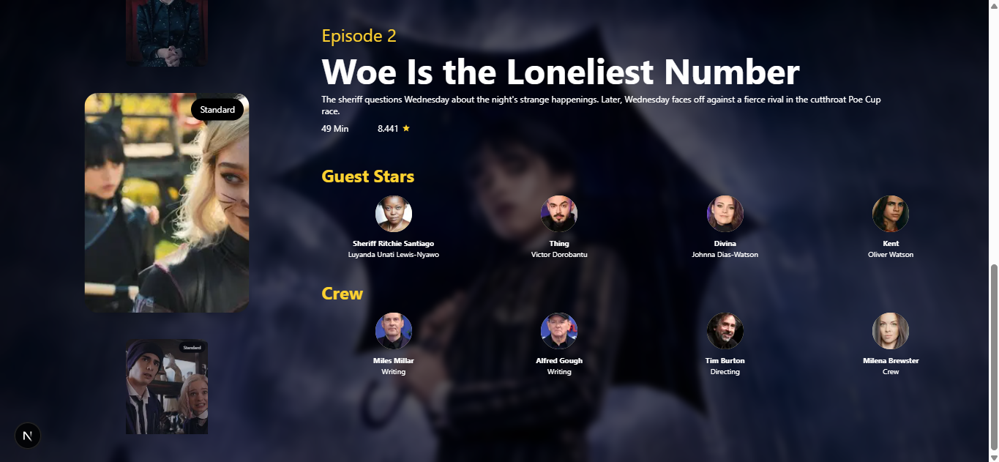

# 🎬 Movie App Pro  

Movie App Pro is a fully responsive, **Next.js**-powered web application designed to deliver a seamless and visually engaging movie & TV show exploration experience — inspired by **TMDB**.  

This project is built to be **fast, dynamic, and user-friendly**, offering detailed insights about movies, TV shows, cast members, and more.  

- Purpose :
This project aims to be a comprehensive guide to movies and TV shows, helping users explore and discover content in an interactive, visually appealing, and fast-loading way — perfect for learning SSR, state management, and API integration in Next.js.

## 🚀 Features  

✅ **Server-Side Rendering (SSR)** – Fast data fetching & SEO-friendly pages  
✅ **Dynamic Movie & TV Details** – Dive deeper into movies, series, cast, and crew  
✅ **Redux Integration** – Manage Favorites & Watchlist efficiently  
✅ **YouTube Trailers** – Embedded trailers using iFrame  
✅ **Swiper Sliders** – Smooth horizontal & vertical scroll for episodes & cards  
✅ **TailwindCSS** – Clean, fully responsive design for all devices  
✅ **AOS Animations** – Elegant scroll-based animations  
✅ **Optimized Images** – `next/image` for lazy loading & better performance  
✅ **Suspense + Loading Fallback** – Smooth experience for slow networks  
✅ **Smart Caching** – Cached static data & dynamic updates with `useEffect`  

---

## 🛠 Tech Stack  

- **Framework:** Next.js (React)
- **Styling:** TailwindCSS  
- **State Management:** Redux  
- **API:** TMDB API  
- **UI Libraries:** Swiper.js, AOS  
- **Deployment:** Vercel-ready  

---

## 📸 Screenshots  

| Home Page | Movie Details | Episodes View |
|----------|---------------|---------------|
|  |  |  |

---

## 📂 Installation & Usage  

Clone the repository and install dependencies:  

```bash
git clone https://github.com/MohamedKamal4/movie-app-pro.git
cd movie-app-pro
npm install
